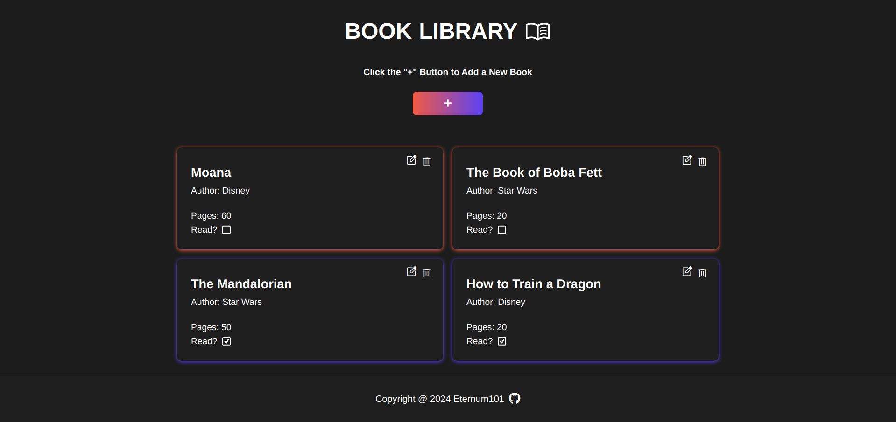
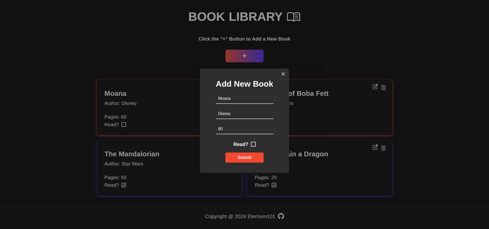

# Library App

🔗 [View Demo](https://eternum101.github.io/library-app/)

## Table of Contents
- [About The Project](#about-the-project)
- [Built With](#built-with)
- [Screenshots](#screenshots)
- [Features](#features)

## About The Project
A Simple Library Application Where You Can Add Books.

## Screenshots

### Initial Screen

### Add New Book

### Edit Book

[Back to Top](#library-app)

## Built With
- HTML
- CSS
- JavaScript

[Back to Top](#library-app)

## Features

- Displays Each Book in Users Library
- Ability to Add New Book, Delete Book & Edit Book
- Read Status

[Back to Top](#library-app)
